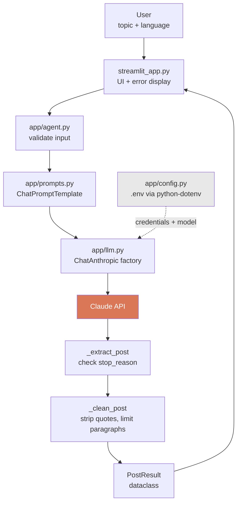

# LinkedIn AI Agent

An AI agent built with **LangChain** and **Claude** that generates professional,
publication-ready LinkedIn posts from a topic and a target language.


---

## 1. Project Overview

LinkedIn AI Agent is a small, production-shaped AI application. The user supplies
a **topic** and a **language**; the agent composes a LangChain prompt, sends it to
an LLM, validates what comes back, and returns a post that can be pasted straight
into LinkedIn.

The project is deliberately compact — five Python modules and a Streamlit UI — but
it is structured the way a real LLM feature would be: configuration is isolated,
the prompt is versioned separately from the code that runs it, model output is
validated rather than trusted, and the whole pipeline is unit-tested without
touching the network.

## 2. Project Objective

Build a professional AI agent using LangChain that generates LinkedIn posts,
where the user provides:

1. The **topic** of the post
2. The **language** of the post

The system uses LangChain and an LLM to produce a professional LinkedIn-style post
in the requested language.

## 3. Features

- Generates a complete LinkedIn post from a topic and a language
- **Five languages** — English, Bengali, Spanish, French, German — written
  natively rather than translated from English
- Prompt engineered specifically for LinkedIn: hooks that survive the "see more"
  fold, no invented personal anecdotes, no AI-sounding filler, no fabricated
  statistics
- **Output validation** — detects truncated and refused responses instead of
  passing them off as finished posts
- **Deterministic paragraph limit** — merges overflow paragraphs down to four
- Character counter against LinkedIn's 3,000-character limit
- One-click copy of the finished post
- User-facing error messages that never leak API keys or stack traces
- **47 tests** — 38 run offline with no API key required

> **Not implemented:** there is no self-review/revision loop, no post scheduling,
> and no LinkedIn API integration. See [Future Improvements](#16-future-improvements).

## 4. Architecture

The application is a linear pipeline. Each stage has one responsibility and is
independently testable.



**Why it is shaped this way**

| Layer | Responsibility | Why it is separate |
|---|---|---|
| `config.py` | Reads `.env`, validates settings | The only module that touches `os.environ`, so secrets have exactly one entry point |
| `prompts.py` | Owns the prompt wording | Prompt iteration is the main tuning loop; it should not require touching logic |
| `llm.py` | Builds the configured model | One place to change model, token budget, timeouts |
| `agent.py` | Composes the chain, validates I/O | The only module that knows the pipeline exists |
| `streamlit_app.py` | Presentation and error rendering | Contains no prompt or model knowledge |

Two boundaries matter most for review:

- **Input is validated before any paid API call** — an empty or over-long topic
  fails locally.
- **Output is validated before the user sees it** — the model's `stop_reason` is
  inspected, so a truncated post raises an error instead of appearing complete.

## 5. Technology Stack

| Component | Version | Role |
|---|---|---|
| Python | 3.11+ (tested on 3.14.2) | Runtime |
| `langchain` | 1.3.x | Prompt templates, runnable composition |
| `langchain-anthropic` | 1.6.x | `ChatAnthropic` integration |
| `anthropic` | 0.125.x | Claude API SDK |
| `streamlit` | 1.62.x | Web UI |
| `python-dotenv` | 1.2.x | Loads `.env` |
| `pytest` | 9.1.x | Test runner |

The LLM is **Claude Opus 5** (`claude-opus-5`) by default, configurable via `.env`.

> `anthropic` is capped below `1.0` because `langchain-anthropic` 1.6.x requires
> it. Raise the cap once the LangChain integration supports the 1.x SDK.

## 6. How LangChain is used

LangChain provides three things here, all visible in `app/agent.py`:

**`ChatPromptTemplate`** — the prompt is a template with two variables, not an
f-string. LangChain renders it into a proper system + human message pair:

```python
POST_PROMPT = ChatPromptTemplate.from_messages([
    ("system", SYSTEM_PROMPT),   # role, rules, output format
    ("human", HUMAN_PROMPT),     # "Topic: {topic}\nLanguage: {language}"
])
```

**`ChatAnthropic`** — the provider integration, configured once in `app/llm.py`.
Swapping providers means changing this file only.

**Runnable composition (LCEL)** — stages are joined with the `|` operator into a
`RunnableSequence`:

```python
def build_chain() -> Runnable:
    return get_post_prompt() | get_llm() | RunnableLambda(_extract_post)
```

Each stage's output feeds the next. Note the third stage: the usual choice here is
`StrOutputParser`, but it discards response metadata — including `stop_reason` —
so a post cut off at the token limit would look identical to a finished one. A
custom `RunnableLambda` checks that first.

## 7. How the AI Agent works

1. **Validate** — topic and language must be non-empty; the topic is capped at 200
   characters. Nothing is sent to the API if this fails.
2. **Render the prompt** — the topic and language are injected into the template.
   The system prompt carries the rules: 2–4 paragraphs, an engaging hook, one
   substantive insight, no fabricated experience or statistics, no AI-sounding
   filler, and output with no title or wrapping quotes.
3. **Call the model** — `ChatAnthropic` sends the messages to Claude with a 4,000
   token budget, a 60-second timeout, and 2 automatic retries.
4. **Check why it stopped** — `stop_reason` of `max_tokens` (truncated) or
   `refusal` (declined) raises a `PostGenerationError` instead of returning
   unusable text.
5. **Clean the output** — strip whitespace and stray wrapping quotes, then merge
   any paragraphs beyond four. Prompting alone held the 2–4 rule only about 80% of
   the time, so the limit is enforced in code as well.
6. **Return a `PostResult`** — a frozen dataclass carrying the topic, language, and
   finished post.

```python
@dataclass(frozen=True)
class PostResult:
    topic: str
    language: str
    generated_post: str
    review_summary: str | None = None   # reserved; no review step yet
    was_improved: bool = False          # reserved; always False today
```

The last two fields are **placeholders for a future review step and are not
populated by any current code path.**

Errors are mapped to plain language before they reach the UI: rejected key,
unknown model, rate limit, timeout, connection failure, and a generic fallback.
Raw API messages are logged for the developer, never displayed.

## 8. Project Structure

```
linkedin-ai-agent/
├── app/
│   ├── __init__.py
│   ├── agent.py            # Chain composition, validation, PostResult
│   ├── config.py           # .env loading and settings
│   ├── llm.py              # ChatAnthropic factory
│   └── prompts.py          # System + human prompt templates
├── tests/
│   ├── __init__.py
│   ├── conftest.py         # --run-integration flag and marker
│   ├── test_agent.py       # 38 offline unit tests
│   └── test_integration.py # 9 real-API tests (opt-in)
├── demo/
│   └── demo.mp4            # Demo walkthrough video
├── screenshots/
├── .env.example
├── .gitignore
├── requirements.txt
├── streamlit_app.py        # Streamlit UI
└── README.md
```

## 9. Installation

Requires Python 3.11 or newer.

```bash
git clone https://github.com/mehedihasansabbir220/linkedin-ai-agent.git
cd linkedin-ai-agent

python3 -m venv .venv
source .venv/bin/activate          # Windows: .venv\Scripts\activate

pip install -r requirements.txt
```

## 10. Environment Variables

Copy the template and add your key:

```bash
cp .env.example .env
```

| Variable | Required | Default | Description |
|---|---|---|---|
| `ANTHROPIC_API_KEY` | **Yes** | — | From [console.anthropic.com](https://console.anthropic.com/settings/keys) |
| `ANTHROPIC_MODEL` | No | `claude-opus-5` | Claude model to use |
| `ANTHROPIC_EFFORT` | No | `high` | Reasoning depth: `low`, `medium`, `high`, `xhigh`, `max` |

```env
ANTHROPIC_API_KEY=your_api_key_here
ANTHROPIC_MODEL=claude-opus-5
ANTHROPIC_EFFORT=high
```

`.env` is git-ignored. No key appears anywhere in the source, and a missing or
placeholder key fails with a clear setup message before any API call.

> Claude Opus 5 does not accept a `temperature` parameter. `ANTHROPIC_EFFORT`
> is the equivalent control for output variability and token spend.

## 11. Running the application

```bash
source .venv/bin/activate
streamlit run streamlit_app.py
```

The app opens at `http://localhost:8501`.

To use the agent directly from Python:

```python
from app.agent import generate_linkedin_post, generate_post_result

post = generate_linkedin_post("remote onboarding", "English")   # -> str
result = generate_post_result("remote onboarding", "English")   # -> PostResult
```

## 12. Example Inputs

| Topic | Language |
|---|---|
| AI in Healthcare | English |
| Remote Work Productivity | Bengali |
| Future of Artificial Intelligence | Spanish |
| Technical debt in startups | English |
| Mentoring junior engineers | German |

## 13. Example Outputs

**English — "AI in Healthcare"**


> A diagnostic model can beat clinicians on a benchmark and still change nothing
> about patient care. That gap — between validation and adoption — is where most
> healthcare AI quietly dies, and it has very little to do with the algorithm.

**Bengali — "Remote Work Productivity"** (1,358 / 3,000 characters)


**Spanish — "Future of Artificial Intelligence"** (1,488 / 3,000 characters)


> La conversación sobre inteligencia artificial suele girar en torno a qué modelo
> es más potente. En la práctica, lo que decide si un proyecto funciona rara vez
> es el modelo.

Posts are generated fresh on every run, so the same topic produces different
output each time.

## 14. Testing

```bash
pytest                      # 38 unit tests — offline, no API key, ~1s
pytest --run-integration    # adds 9 real-API tests — ~35s, uses credit
pytest -v                   # one line per test
```

**Unit tests** replace the model with a scripted fake via `monkeypatch`, so they
need no API key and make no network calls. They cover input validation, output
cleaning, paragraph merging, truncation and refusal detection, the `PostResult`
structure, and every mapped API error.

**Integration tests** make two real API calls and assert the prompt rules the
model must obey: paragraph count, banned phrases, emoji restraint, no AI
self-reference, no wrapping quotes, and that a German request actually produces
German. They are skipped unless `--run-integration` is passed, so a normal
`pytest` run never costs money.

```
$ pytest
38 passed, 9 skipped in 0.89s

$ pytest --run-integration
47 passed in 44.86s
```

## 15. Demo Video

A 1 minute 49 second walkthrough covering three generations end to end:

| Topic | Language |
|---|---|
| AI in Healthcare | English |
| Remote Work Productivity | Bengali |
| Future of Artificial Intelligence | Spanish |

It shows the app starting from source, each post being generated with the live
elapsed-time spinner, and the finished posts with their character counts.

**▶ [Watch the demo](demo/demo.mp4)** (MP4, 1280×720)

<!--
  To make the video play inline on GitHub instead of opening in a new tab,
  drag demo/demo.mp4 into a GitHub issue or the web README editor. GitHub
  uploads it and returns a URL like:

      https://github.com/mehedihasansabbir220/linkedin-ai-agent/assets/<id>/<uuid>

  Paste that URL on its own line here and GitHub renders a player.
-->

## 16. Future Improvements

- **Self-review loop** — a second LLM pass that critiques and revises the draft,
  populating the `review_summary` and `was_improved` fields that already exist on
  `PostResult`. This is the most valuable next step and would make the project a
  true multi-step agent rather than a single chain.
- **Tone and audience controls** — let the user pick a register (technical,
  executive, casual) and a target audience.
- **Prompt caching** — the system prompt is identical on every request and could
  be cached to cut input cost.
- **Post history** — persist previous generations for comparison.
- **Regenerate and download buttons** in the UI.
- **Custom language input** — the language field currently accepts anything, but
  the UI only offers five options.
